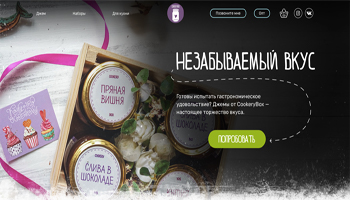
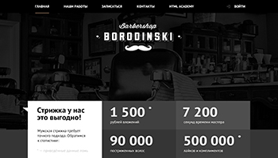

<meta name='freelancehunt' content='4784a3120edd0e7' />
<h1 style="text-align:center;font-weight:bold;">Верстка сайтов/Frontend разработка</h1>
<ul style="list-style:none;display:flex;max-width:500px;padding:0;margin:0 auto;margin-bottom:20px;justify-content:space-between;flex-wrap:wrap;font-weight:bold;">
  <li style="padding:10px; border:1px solid green;">HTML5</li>
  <li style="padding:10px; border:1px solid green;">CSS3/SCSS/LESS</li>
  <li style="padding:10px; border:1px solid green;">JS/GULP</li>
</ul>
<b style="text-align:center;">Мои проекты</b> (перейти на сайты можно, кликнув по картинке-превью): 
<ul style="list-style:none;display:flex;max-width:940px;margin:0 auto;margin-bottom:20px;padding:0;justify-content:space-between;flex-wrap:wrap;">
  <li>
<b>Интернет-магазин мороженого "Gllacy-shop"</b>
</li>
  <li>
<b>Сайт барбершопа "Бородинский"</b>
</li>
  <li>
<b>Интернет-магазин джема и варенья "Cookery-box"</b>
</li>
  <li>
<b>Новая адаптивная версия сайта барбершоп "Бородинский"</b>
</li>
</ul>
